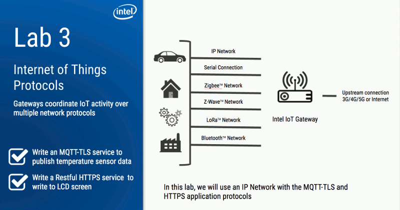
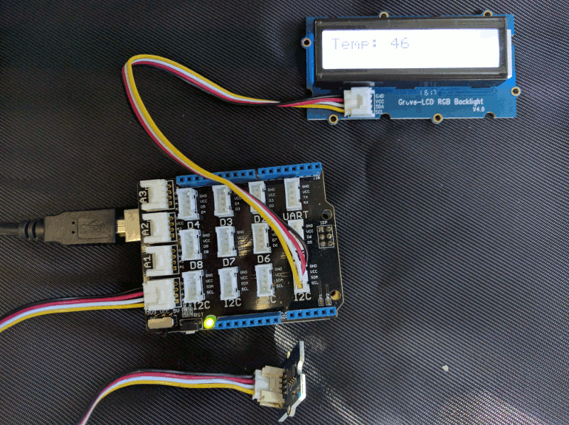
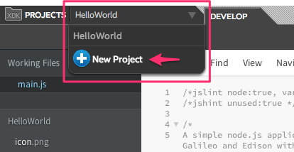
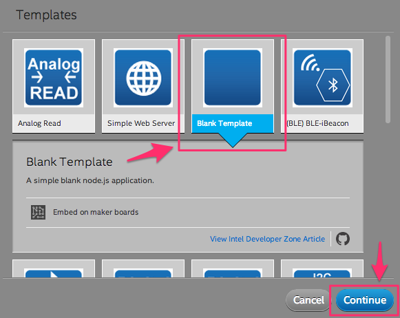

# Objectives

## Overview



### Read the Objectives

By the end of this module, you should be able to:

* Create a NodeJS service that sends temperature data to the gateway via MQTT
* Create a NodeJS service that implements a Restful HTTP API to control the LCD screen.

# Creating an MQTT Service to Publish the Temperature Sensor Data

## Plug in the Grove shield, temperature sensor and the LCD



In the Sensors and Actuators lab, we connected the temperature sensor (Analog) and LCD display (I2C) to your Arduino* 101. We wrote NodeJS code using the Intel® XDK IoT Edition to measure the temperature in Celsius using upm library, convert it to Fahrenheit, then display it on the LCD.

Your project should start looking like the picture on the right.

1. Install the Grove Base Shield onto the Arduino* 101 Arduino expansion board.
2. Connect **Grove Temperature Sensor** to analog pin **A0** of the Grove Base Shield.
3. Connect **Grove LCD** display to one of the **I2C** pins.

## Start a new project in the Intel® XDK using a blank template.



1. Start a new project in the Intel® XDK using a blank template.
2. If you have an Intel® XDK project already open, click on the projects drop down menu in the upper left hand corner, then select **New Project**.

This temperature project will be used in all the later labs to supply a steady stream of data.

## Select the Blank Template



Choose **Blank Template** from the list of templates, then click **Continue**.

The Intel® XDK will create and open main.js for you.

### Copy the code from the JavaScript Sensors and Actuators Lab into this new project

In the Sensors and Actuators lab, we created a program to read the temperature and display is on the LCD screen. It should look something like this.

```js
var mraa = require("mraa") ;
mraa.addSubplatform(mraa.GENERIC_FIRMATA, "/dev/ttyACM0");

// Include the JavaScript UPM libraries
var groveSensor = require('jsupm_grove');
var LCD = require("jsupm_12clcd"); // Create a new instance of a Grove RGB LCD screen

// The Offset is necessary for Firmata
var OFFSET = 512;

// Instantiate the temperature sensor and LCD actuator
var temp = new groveSensor.GroveTemp(0+OFFSET, 0.66); // Create a new instance of a Grove Temperature Sensor
var screen = new LCD.Jhd1313m1(0+OFFSET, 0x3E, 0x62);

// monitor: creates an anonymous function that runs once per second
// The function will get the temperature and display it on the LCD.
function monitor() {
    setInterval(
      function() {
        // Read the temperature sensor
        var celsius = temp.value();

        // Convert it to fahrenheit
        var fahrenheit = Math.round(celsius * 9.0 / 5.0 + 32.0);

        // Log it to the console window
        console.log(celsius + "° Celsius, or " + fahrenheit + "° Fahrenheit");

        // Update the LCD screen
        screen.setCursor(0, 0);
        screen.setColor(255, 255, 255);
        screen.write("Temp: " + celsius + "C or " + fahrenheit + "F");
    }, 1000);
}

// Call the monitor function once
monitor();
```

### Remove the LCD Code

Now we will remove the LCD code. This is straight forward. Simply remove any line that has a reference to the screen or LCD variables.


```js
var mraa = require("mraa") ;
mraa.addSubplatform(mraa.GENERIC_FIRMATA, "/dev/ttyACM0");

// Include the JavaScript UPM libraries
var groveSensor = require('jsupm_grove');

// The Offset is necessary for Firmata
var OFFSET = 512;

// Instantiate the temperature sensor and LCD actuator
var temp = new groveSensor.GroveTemp(0+OFFSET, 0.66); // Create a new instance of a Grove Temperature Sensor

// monitor: creates an anonymous function that runs once per second
// The function will get the temperature and display it on the LCD.
function monitor() {
  setInterval(
    function() {
      // Read the temperature sensor
      var celsius = temp.value();

      // Convert it to fahrenheit
      var fahrenheit = Math.round(celsius * 9.0 / 5.0 + 32.0);

      // Log it to the console window
      console.log(celsius + "° Celsius, or " + fahrenheit + "° Fahrenheit");
  }, 1000);
}

// Call the monitor function once
monitor();
```

### Remove the LCD Code

Next add MQTT as a dependency in your package.json.


```js
{
  "name": "protocol-mqtt",
  "description": "Creates a simple service to publish a temperature sensor's data over MQTT",
  "version": "0.0.0",
  "main": "main.js",
  "engines": {
    "node": ">=0.10.0"
  },
  "license": "BSD-3-Clause",
  "private": true,
  "dependencies": {
      "mqtt": "latest"
  }
}
```

### Add the MQTT connect code

The preferred method of connecting to the MQTT broker is over MQTT-TLS. Since we have now setup the SSL certificates we will use TLS configuration in the code.

Make sure SSL certificates are installed as per instructions in **Setup TLS** lab

Add following lines of code for an encrypted MQTT connection just below the line that creates the temp sensor.

```js
// Require MQTT and setup the connection to the broker
var mqtt = require('mqtt');
var fs = require('fs');
var KEY = fs.readFileSync('/etc/mosquitto/certs/server.key');
var CERT = fs.readFileSync('/etc/mosquitto/certs/server.crt');
var TRUSTED_CA_LIST = [fs.readFileSync('/etc/mosquitto/ca_certificates/ca.crt')];

var PORT = 8883;
var HOST = 'localhost';

var options = {
  port: PORT,
  host: HOST,
  protocol: 'mqtts',
  protocolId: 'MQIsdp',
  keyPath: KEY,
  certPath: CERT,
  rejectUnauthorized : false,
  //The CA list will be used to determine if server is authorized
  ca: TRUSTED_CA_LIST,
  secureProtocol: 'TLSv1_method',
  protocolVersion: 3
};
var mqttClient = mqtt.connect(options);
```

### Add the MQTT code to publish the sensor data

Next we will add the code to publish the sensor data over MQTT at the end of the anonymous function.


```js
// Get the current time
var current_time = (new Date()).getTime();

/*
  This JSON structure is extremely important
  future labs will assume that every temperature
  reading has a "sensor_id", "value" and "timestamp"
*/
var json = {
  sensor_id : "temperature",
  value : celsius,
  timestamp : current_time
};

// Convert the JSON object to a string
var str = JSON.stringify(json);

// Log the string to the console
console.log(str);

// Publish the temperature reading string on the MQTT topic
mqttClient.publish("sensors/temperature/data", str);
```

### The complete code to publish the temperature sensor over MQTT

Here is the complete code for this lab.


```js
var mraa = require("mraa") ;
mraa.addSubplatform(mraa.GENERIC_FIRMATA, "/dev/ttyACM0");

//Require MQTT and setup the connection to the broker
var mqtt = require('mqtt');
var fs = require('fs');
var KEY = fs.readFileSync('/etc/mosquitto/certs/server.key');
var CERT = fs.readFileSync('/etc/mosquitto/certs/server.crt');
var TRUSTED_CA_LIST = [fs.readFileSync('/etc/mosquitto/ca_certificates/ca.crt')];

var PORT = 8883;
var HOST = 'localhost';

var options = {
  port: PORT,
  host: HOST,
  protocol: 'mqtts',
  protocolId: 'MQIsdp',
  keyPath: KEY,
  certPath: CERT,
  rejectUnauthorized : false,
  //The CA list will be used to determine if server is authorized
  ca: TRUSTED_CA_LIST,
  secureProtocol: 'TLSv1_method',
  protocolVersion: 3
};
var mqttClient = mqtt.connect(options);

// Include the JavaScript UPM libraries
var groveSensor = require('jsupm_grove');
var LCD = require("jsupm_i2clcd"); // Create a new instance of a Grove RGB LCD screen

// The Offset is necessary for Firmata
var OFFSET = 512;

// Instantiate the temperature sensor and LCD actuator
var temp = new groveSensor.GroveTemp(0+OFFSET, 0.66); // Create a new instance of a Grove Temperature Sensor
var screen = new LCD.Jhd1313m1(0+OFFSET, 0x3E, 0x62);
// monitor: creates an anonymous function that runs once per second
// The function will get the temperature and display it on the LCD.
function monitor() {
  setInterval(
    function() {
      // Read the temperature sensor
      var celsius = temp.value();

      // Convert it to fahrenheit
      var fahrenheit = Math.round(celsius * 9.0 / 5.0 + 32.0);

      // Log it to the console window
      console.log(celsius + "° Celsius, or " + fahrenheit + "° Fahrenheit");

        // Get the current time
        var current_time = (new Date()).getTime();

        /*
          This JSON structure is extremely important
          future labs will assume that every temperature
          reading has a "sensor_id", "value" and "timestamp"
        */
        var json = {
          sensor_id : "temperature",
          value : celsius,
          timestamp : current_time
        };
        // Convert the JSON object to a string
        var str = JSON.stringify(json);

        // Log the string to the console
        console.log(str);

        // Publish the temperature reading string on the MQTT topic
        mqttClient.publish("sensors/temperature/data", str);
    }, 1000);
}

// Call the monitor function once
monitor();
```

### Deploy the application

Upload and run your application from Intel® XDK

### See the Debugging MQTT section in the sidebar under Additional Information

You've completed the service that will publish temperature data to the gateway. See the Debugging MQTT section in the sidebar under Additional Information for information on how to verify that MQTT traffic is indeed being published.

# Additional Resources

* [MQTT](http://mqtt.org/)
* [ExpressJS](https://www.npmjs.com/package/express)
* [REST](https://en.wikipedia.org/wiki/Representational_state_transfer)
